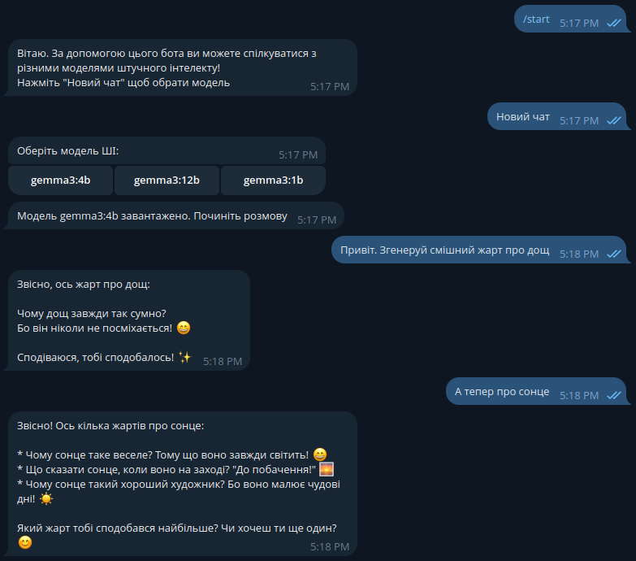

# 🤖 Telegram AI-чат-бот з Ollama

Простий Telegram-бот на базі [Ollama](https://ollama.com/), який дозволяє спілкуватися з локальними AI-моделями. Підтримує контекстну розмову та перемикання моделей.

## 🚀 Можливості

- 🧠 Відповіді AI з урахуванням контексту
- 🔄 Перемикання між встановленими LLM-моделями
- ⚡ Швидка локальна інференція через Ollama
- 🤖 Інтерфейс Telegram-бота

## 📸 Демонстрація



## 🛠️ Встановлення

```bash
git clone https://github.com/yourusername/ollama_tg_bot.git
cd ollama_tg_bot
python -m venv .venv
source .venv/bin/activate
pip install -r requirements.txt
```
Переконайтеся, що Ollama встановлений і запущений.

## ⚙️ Налаштування
Створіть файл .env у кореневій директорії:
```env
BOT_KEY=your_token_here
```

## ▶️ Використання
```bash
python bot.py
```
